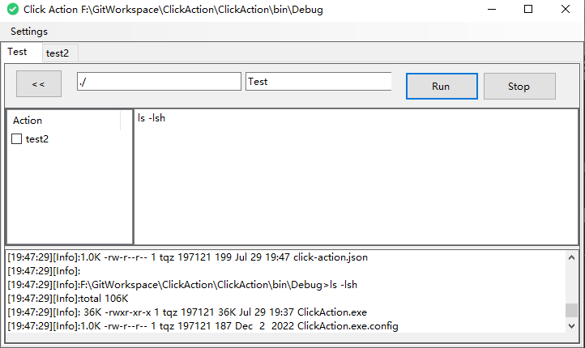

# ClickAction

## 快速启动本地任务

第一次启动后需要在菜单：Settings->New Action后才能看到任务界面

任务界面左侧按顺序列出了除当前任务的所有其他任务，勾选上后表示前置依赖

点击“<<”按钮可以将当前任务的顺序向前挪动，该按钮后面的两个输入框分别是运行路径、任务名称。

- 运行路径是相对于ClickAction.exe文件的路径

点击Run的时候将命令行文本框的内容写入到临时bat文件，调用子进程执行bat文件

更多介绍可以点击：[ClickAction - 本地任务快速启动器
](https://coderthing.com/archives/1690631987267)